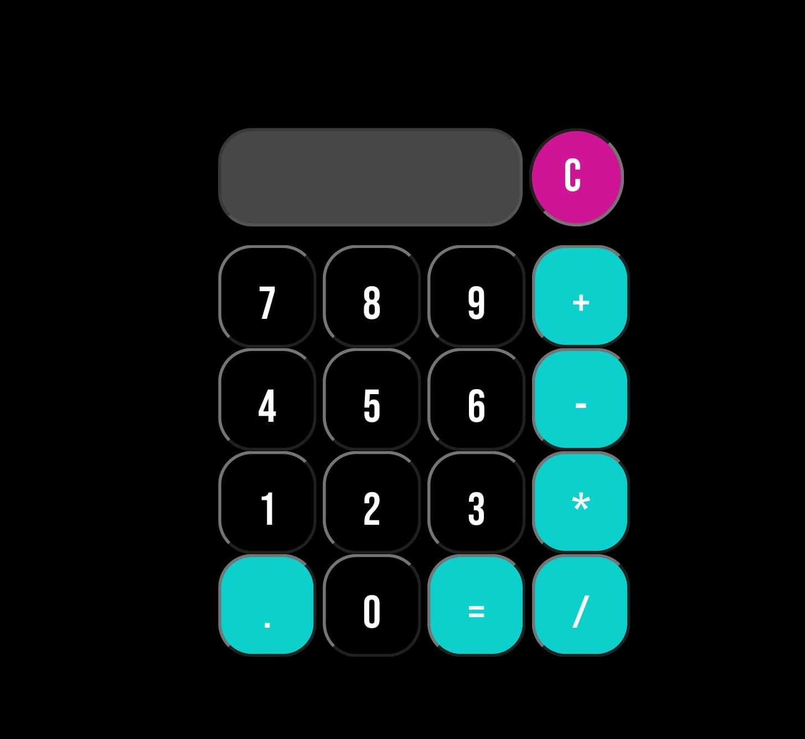

# Calculadora

Criado com javascript, usando comandos reload e eval para encurtar o código

Estilizado com google fonte @import url('https://fonts.googleapis.com/css2?family=Bebas+Neue&display=swap');

    

